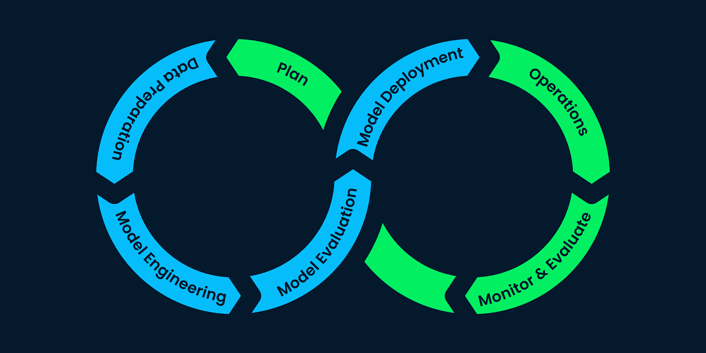
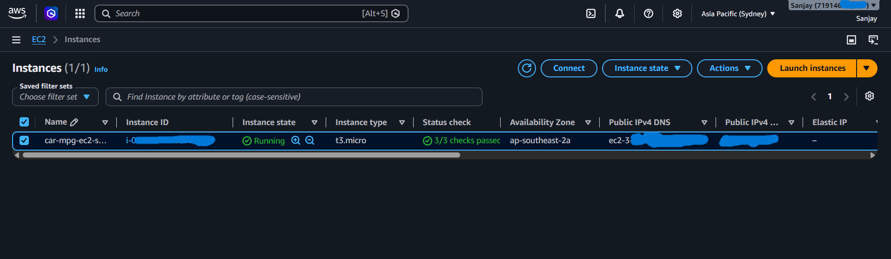
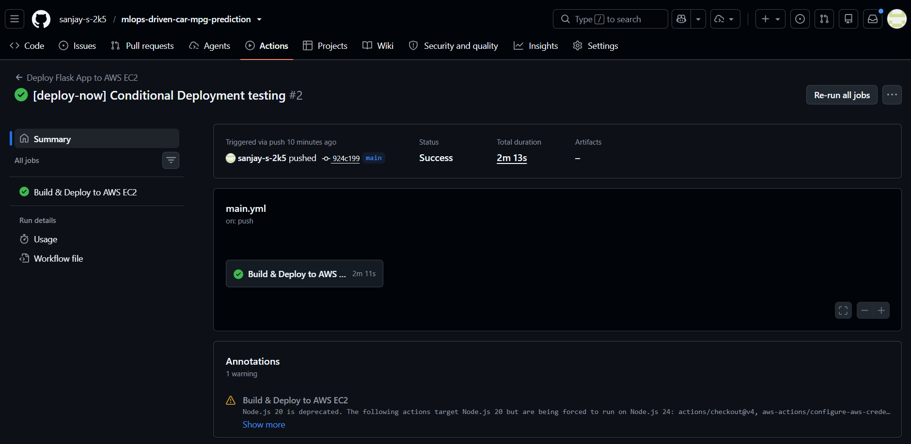
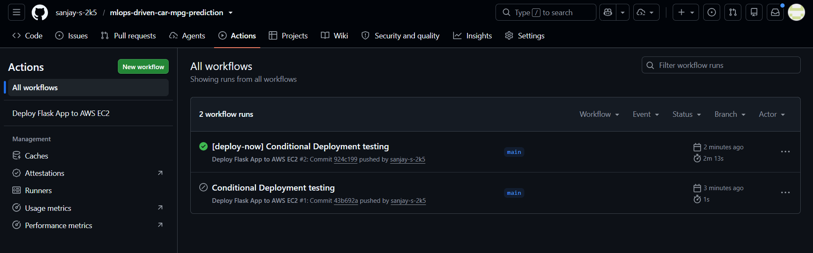
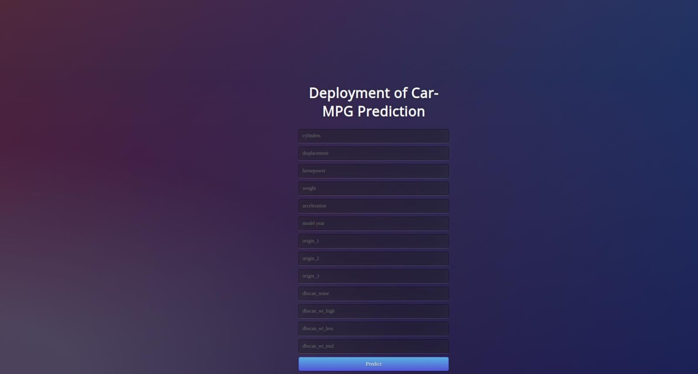

# MLOPS-DRIVEN CAR MPG PREDICTION (AWS EC2 DEPLOYMENT)

<h2> Project Objective:</h2>



<p>
The project aims to focus on Unsupervised Learning approach to increase the model efficiency <br>
and the core MLOps life cycle concepts (excluding monitoring and retraining) that includes: <br>
</p>
- Data Preprocessing<br>
- Model Training <br>
- Model Validation<br>
- Model Packaging (using pickle files and docker images for encapsulation) <br>
- CI/CD Pipelines with conditional trigger for deployment (GitHub Actions)<br>
- Model Deployment using Amazon Elastic Container Registry (ECR) for storing Docker images <br>
  and AWS EC2 (t2.micro / t3.micro) to deploy the dockerized model.<br>

<p>
<h4> Unsupervised Learning algorithms like K-Means and DBSCAN clustering are performed and interesting relationships between the features (miles per gallon (mpg), weight of car, Horse power) are found. Regression model is trained using original dataset along with the feature labels obtained from the Unsupervised learning models and comparison of various models is done. Finally the best model is saved for the deployment purposes.</h4> 

Dataset is taken from Kaggle.<br> Link : https://www.kaggle.com/datasets/uciml/autompg-dataset</p>

<h2> Amazon Web Services (AWS Free Tier) Used:</h2>

- **AWS ECR (Elastic Container Registry)**: Private Docker image registry (500 MB/month free).
- **AWS EC2 (t2.micro / t3.micro)**: Server instance (**750 hours/month FREE** for 12 months).
- **AWS IAM**: Security & Access Management for GitHub Actions CI/CD.

<h3>AWS CLI & Docker Deployment Commands:</h3>

<ul>
  <li>
    <strong>Create Elastic Container Registry (ECR):</strong>
    <pre><code>aws ecr create-repository --repository-name car-mpg-prediction --region us-east-1</code></pre>
  </li>

  <li>
    <strong>Authenticate Docker to ECR:</strong>
    <pre><code>aws ecr get-login-password --region us-east-1 | docker login --username AWS --password-stdin &lt;aws_account_id&gt;.dkr.ecr.us-east-1.amazonaws.com</code></pre>
  </li>

  <li>
    <strong>Build & Tag Docker Image:</strong>
    <pre><code>docker build -t car-mpg-prediction .</code></pre>
    <pre><code>docker tag car-mpg-prediction:latest &lt;aws_account_id&gt;.dkr.ecr.us-east-1.amazonaws.com/car-mpg-prediction:latest</code></pre>
  </li>

  <li>
    <strong>Push Image to Amazon ECR:</strong>
    <pre><code>docker push &lt;aws_account_id&gt;.dkr.ecr.us-east-1.amazonaws.com/car-mpg-prediction:latest</code></pre>
  </li>

  <li>
    <strong>Run Container on EC2 Instance:</strong>
    <pre><code>docker run -d --name car-mpg-app -p 80:5000 -e PORT=5000 &lt;aws_account_id&gt;.dkr.ecr.us-east-1.amazonaws.com/car-mpg-prediction:latest</code></pre>
  </li>
</ul>

<h2> AWS EC2 Instance Setup: </h2>

The AWS EC2 (`t2.micro` / `t3.micro`) instance acts as the host server for running the dockerized Flask web application.



<h2> GitHub CI/CD Pipeline: </h2>

The automated GitHub Actions workflow (`.github/workflows/main.yml`) performs:
1. Authentication to AWS using GitHub Secrets (`AWS_ACCESS_KEY_ID`, `AWS_SECRET_ACCESS_KEY`, `AWS_REGION`).
2. Logging into AWS ECR.
3. Building & pushing the Docker image to ECR.
4. SSH connecting into the AWS EC2 instance, pulling the updated Docker image, and running the container.



<h2> Conditional Deployment: </h2>

Conditional deployment of the ML model is ensured to prevent deployment in the CI/CD pipeline unless the commit message contains <strong>"[deploy-now]"</strong>.

```bash
git commit -m "[deploy-now] Deploying model to AWS EC2 instance"
git push origin master
```



<h2> Deployed Model & Live Application: </h2>

The web interface of the deployed Car MPG prediction application running live on AWS EC2.

